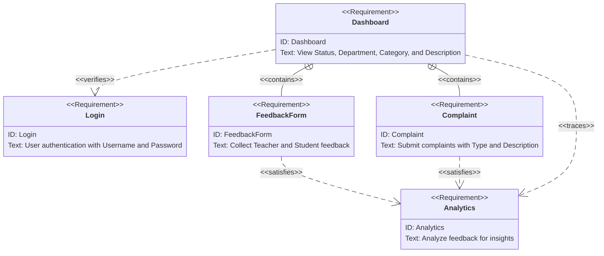

# ISMT SpeakUp

ISMT SpeakUp is a Complain Management System for ISMT College to efficiently handle and resolve student, faculty, and staff complaints and collect feedbacks from students in a more effective manner. This system will streamline the process of lodging, tracking, and resolving complaints, ensuring timely responses and improving overall satisfaction within the institution.

**Features**:

- **Automated Complaint Categorization**: Use natural language processing (NLP) to automatically categorize complaints based on their content (e.g., academic issues, facilities, administration).
- **Priority Assignment**: Assign priority levels to complaints based on severity and urgency, ensuring critical issues are addressed promptly.
- **Tracking and Updates**: Provide real-time tracking of complaint status and updates to the complainant, maintaining transparency throughout the resolution process.
- **Response Recommendations**: Suggest potential solutions or responses to administrators based on similar past complaints and their resolutions.
- **Feedback Loop**: Allow users to rate the resolution process and provide feedback, helping to improve the system's efficiency and effectiveness.
- **Analytics and Reporting**: Generate detailed reports and analytics on complaint trends, response times, and resolution rates to identify areas for improvement.
- **Anonymous Reporting**: Enable users to submit complaints anonymously, encouraging more open and honest feedback.
- **Integration with Communication Channels**: Integrate with email, SMS, and institutional portals to facilitate easy submission and updates on complaints.'
- **Popup Notifications**: Sends the notifications to the students and teachers.

