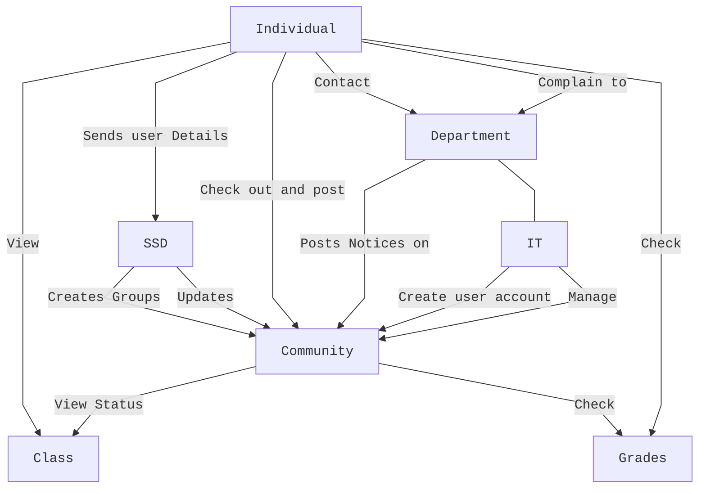
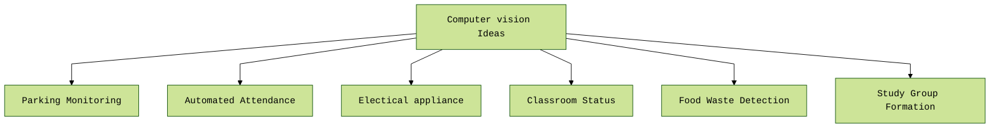
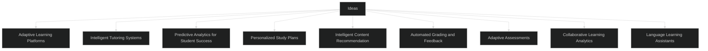

# ISMT Hackathon 2.0 Project Idea Draft

---

## Research

* How to improve learning efficacy for educational instance using information system

---

## Project 1: ISMT Social App (Community based)

### Purpose

* Fostering and Encouraging Community to grow as a community together

### Feature

* Posting feature for encouraging everyone
* Greatly Community

---

### Project 2: Computer vision (GO Green) IOT Based

Checking if the Classroom is empty and if yes turn off the AC   or any electrical appliances automatically.

#### Parking Monitoring

**Description**: Develop a computer vision system to monitor and manage parking spaces on campus, ensuring efficient use of available parking and assisting students in finding available spots.

**Features**:

* **Real-time Parking Spot Detection**: Identify available and occupied parking spaces.

* **Usage Analytics**: Provide data on parking usage trends and peak times.

* **Violation Alerts**: Detect and notify about parking violations.

#### Automated Attendance

**Description**: Create a system that uses facial recognition to automatically record student attendance in classes, reducing manual efforts and ensuring accurate records.

**Features**:

* **Facial Recognition**: Identify and verify student faces.

* **Attendance Logs**: Maintain a record of attendance for each class session.

* **Real-time Notifications**: Alert students and instructors about attendance status.

* **Integration with School Systems**: Sync attendance data with existing school databases.

#### Electrical Appliance Monitoring

**Description**: Develop a computer vision system to monitor the usage of electrical appliances in classrooms, promoting energy conservation and safety.

**Features**:

* **Usage Tracking**: Monitor the duration and frequency of appliance use.

* **Energy Consumption Analysis**: Provide insights into energy usage patterns.

* **Safety Alerts**: Notify users of potential safety issues, such as overheating or overuse.

#### Classroom Status

**Description**: Create a system that uses computer vision to monitor the status of classrooms, including occupancy, cleanliness, and equipment usage, to optimize classroom management.

**Features**:

* **Occupancy Detection**: Identify whether a classroom is occupied or empty.
* **Cleanliness Monitoring**: Detect cleanliness levels and notify maintenance if needed.

* **Equipment Usage Tracking**: Monitor the usage of classroom equipment like projectors and whiteboards.
* **Status Dashboard**: Provide a real-time overview of classroom conditions.

#### Food Waste Detection

**Description**: Develop a system that uses computer vision to monitor and analyze food waste in canteen, aiming to reduce waste and improve sustainability.

**Features**:

* **Waste Volume Detection**: Measure the amount of food waste generated.

* **Waste Type Classification**: Identify and categorize different types of food waste.

* **Analytics and Reports**: Provide insights and trends on food waste.

* **Sustainability Recommendations**: Offer suggestions to reduce food waste.

#### Study Group Formation

**Description**: Create an app that uses computer vision to facilitate the formation of study groups based on students' interests and study habits.

**Features**:

* **Interest Matching**: Identify and match students with similar academic interests.

* **Facial Recognition**: Verify student identities for group formation.

* **Group Suggestions**: Recommend study groups based on courses and schedules.

* **Collaboration Tools**: Provide tools for scheduling study sessions and sharing resources.

---

## Project 3: Improving quality  of education  using Machine learning  for personalized learning

Based on owns strengths, intrests and prefences learning styles and abilities. The app optimizes the learning experiences to their real potentials.

### Adaptive Learning Platforms

**Description**: Develop a learning platform that uses machine learning to adapt educational content and assessments to the individual needs and learning pace of each student.

**Features**:

* **Personalized Content Delivery**: Tailor lessons based on student performance and preferences.

* **Real-time Feedback**: Provide instant feedback on assignments and quizzes.

* **Progress Tracking**: Monitor student progress and adjust difficulty levels accordingly.

* **Skill Gap Analysis**: Identify areas where students need improvement and recommend targeted practice.

### Intelligent Tutoring Systems

**Description**: Create AI-driven tutoring systems that provide personalized support and instruction in various subjects, mimicking one-on-one tutoring sessions.

**Features**:

* **Interactive Problem Solving**: Guide students through problems step-by-step.

* **Natural Language Processing**: Understand and respond to student queries in natural language.

* **Customized Learning Paths**: Develop individualized learning paths based on student data.

* **Performance Analytics**: Analyze student performance to offer tailored tips and strategies.

### Predictive Analytics for Student Success

**Description**: Implement machine learning models to predict student performance and identify those at risk of falling behind, allowing for early interventions.

**Features**:

* **Risk Assessment**: Predict students at risk of underperforming or dropping out.
* **Intervention Recommendations**: Suggest specific interventions for at-risk students.
* **Engagement Metrics**: Track and analyze student engagement levels.
* **Alert System**: Notify educators and parents about potential issues in real-time.

### Personalized Study Plans

**Description**: Develop a system that creates personalized study plans based on students’ learning styles, strengths, and weaknesses.

**Features**:

* **Learning Style Analysis**: Assess and categorize students' learning styles.

* **Customizable Schedules**: Generate study plans that fit individual schedules.

* **Resource Recommendations**: Suggest tailored resources like books, videos, and practice exercises.

* **Progress Reviews**: Regularly review and adjust study plans based on student progress.

### Intelligent Content Recommendation

**Description**: Build a recommendation engine that suggests relevant educational content, such as articles, videos, and exercises, based on a student’s learning history and interests.

**Features**:

* **Content Personalization**: Recommend content that matches the student's current learning level and interests.

* **Cross-Subject Insights**: Provide interdisciplinary content to enrich learning.
* **Engagement Tracking**: Monitor how students interact with recommended content.
* **Continuous Learning Paths**: Ensure seamless transitions between topics.

### Automated Grading and Feedback

**Description**: Create a machine learning system to automate grading and provide personalized feedback on assignments, essays, and projects.

**Features**:

* **Automated Scoring**: Grade assignments quickly and accurately.

* **Detailed Feedback**: Offer constructive and personalized feedback.

* **Plagiarism Detection**: Check for originality and highlight potential issues.

* **Learning Analytics**: Provide insights into common mistakes and areas for improvement.

### Adaptive Assessments

**Description**: Develop adaptive assessment tools that adjust the difficulty of questions in real-time based on student responses.

**Features**:

* **Dynamic Questioning**: Tailor the difficulty of questions to student ability.

* **Skill Mastery Tracking**: Identify mastery of specific skills and concepts.

* **Instant Results**: Provide immediate results and insights.

* **Customized Practice**: Recommend targeted practice exercises based on assessment performance.

### Collaborative Learning Analytics

**Description**: Implement a platform that uses machine learning to enhance collaborative learning experiences, ensuring that group work is balanced and effective.

**Features**:

* **Group Formation**: Create balanced and effective study groups.

* **Collaboration Monitoring**: Track and analyze group interactions.

* **Contribution Analysis**: Ensure equitable participation among group members.

* **Feedback Loop**: Provide feedback on group dynamics and suggest improvements.

### Language Learning Assistants

**Description**: Create AI-powered assistants that provide personalized language learning experiences, adapting to the student's proficiency level and pace.

**Features**:

* **Interactive Practice**: Engage students in conversations and exercises.

* **Pronunciation Feedback**: Offer real-time feedback on pronunciation.

* **Vocabulary Building**: Customize vocabulary lists based on the student's progress.

* **Cultural Context**: Integrate cultural insights to enhance language learning.

---
