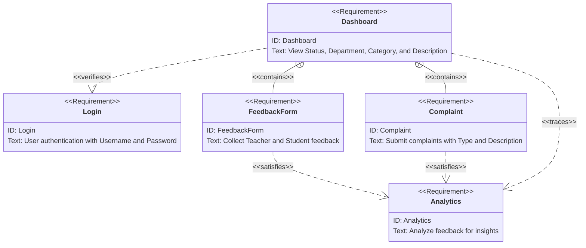

# Team-1-Projects

## Kiko

A Issue/Complain Management System for ISMT College to efficiently handle and resolve student, faculty, and staff complaints and collect feedbacks from students in a more effective manner. This system will streamline the process of lodging, tracking, and resolving complaints, ensuring timely responses and improving overall satisfaction within the institution.

### App Information

```JSON
{
  "appInfo": {
    "name": "Kiko",
    "language": "C#, HTML, CSS, JS",
    "version": "1.0.0",
    "description": "ISMT SpeakUp is a comprehensive Complaint, Issue, and Feedback Management System designed specifically for ISMT College. The platform facilitates seamless communication between students, faculty, and administration by allowing users to report, track, and resolve various issues effectively.",
    "features": [
      "User-friendly interface for submitting complaints, issues, and feedback",
      "Categorized issue tracking and management",
      "Real-time notifications and updates",
      "Anonymous reporting option",
      "Detailed analytics and reporting tools",
      "Role-based access control"
    ],
    "targetAudience": "Students, Faculty, and Administrative Staff of ISMT College"
  },
  "developedBy": [
    "Reyon Rai",
    "Sushan Bajracharya",
    "Prabin Panta",
    "Binod Bhusal"
  ]
}
```

### Features

- **Automated Complaint Categorization**: Use natural language processing (NLP) to automatically categorize complaints based on their content (e.g., academic issues, facilities, administration).
- **Priority Assignment**: Assign priority levels to complaints based on severity and urgency, ensuring critical issues are addressed promptly.
- **Tracking and Updates**: Provide real-time tracking of complaint status and updates to the complainant, maintaining transparency throughout the resolution process.
- **Response Recommendations**: Suggest potential solutions or responses to administrators based on similar past complaints and their resolutions.
- **Feedback Loop**: Allow users to rate the resolution process and provide feedback, helping to improve the system's efficiency and effectiveness.
- **Analytics and Reporting**: Generate detailed reports and analytics on complaint trends, response times, and resolution rates to identify areas for improvement.
- **Anonymous Reporting**: Enable users to submit complaints anonymously, encouraging more open and honest feedback.
- **Integration with Communication Channels**: Integrate with email, SMS, and institutional portals to facilitate easy submission and updates on complaints.'
- **Popup Notifications**: Sends the notifications to the students and teachers.



### Goals

1. **Enhance Communication and Transparency:**
   - Provide a clear and efficient channel for students, faculty, and staff to lodge complaints and provide feedback.
   - Ensure transparency in the complaint resolution process by offering real-time updates and tracking.

2. **Improve Response Times:**
   - Implement automated prioritization of complaints to ensure critical issues are addressed promptly.
   - Provide administrators with response recommendations to expedite the resolution process.

3. **Increase User Engagement and Satisfaction:**
   - Allow users to rate the resolution process and provide feedback to continuously improve the system.
   - Enable anonymous reporting to encourage more open and honest feedback.

4. **Streamline Complaint Management:**
   - Use NLP to automatically categorize complaints, reducing the administrative burden on staff.
   - Integrate with existing communication channels (email, SMS, portals) to facilitate easy submission and updates.

5. **Data-Driven Insights:**
   - Generate detailed analytics and reports on complaint trends, response times, and resolution rates.
   - Use data to identify areas for improvement and make informed decisions to enhance institutional policies and processes.

6. **Ensure System Security and Privacy:**
   - Implement robust user authentication mechanisms to protect user data.
   - Ensure the confidentiality of complaints, especially for anonymous submissions.

7. **Provide a User-Friendly Interface:**
   - Design an intuitive and easy-to-navigate dashboard for users to view complaint status, submit new complaints, and provide feedback.
   - Offer a seamless experience across different devices and platforms.

### Objectives

1. **Develop a User Authentication System:**
   - Implement secure login and registration mechanisms using usernames and passwords to ensure that only authorized users can access the system.

2. **Create an Intuitive Dashboard:**
   - Design and develop a user-friendly dashboard where users can view the status, department, category, and description of their complaints.

3. **Automate Complaint Categorization:**
   - Integrate natural language processing (NLP) to automatically categorize complaints based on their content, streamlining the complaint submission process.

4. **Implement Priority Assignment:**
   - Develop a system to assign priority levels to complaints based on severity and urgency, ensuring critical issues are addressed promptly.

5. **Enable Real-Time Tracking and Updates:**
   - Provide users with real-time updates on the status of their complaints and maintain transparency throughout the resolution process.

6. **Offer Response Recommendations:**
   - Use historical data to suggest potential solutions or responses to administrators for resolving complaints efficiently.

7. **Collect and Analyze Feedback:**
   - Implement feedback forms to collect ratings and comments from users regarding the resolution process, and use analytics to identify trends and areas for improvement.

8. **Generate Detailed Reports:**
   - Create reporting tools that generate detailed analytics on complaint trends, response times, and resolution rates to help administrators make informed decisions.

9. **Enable Anonymous Reporting:**
   - Allow users to submit complaints anonymously to encourage more open and honest feedback.

10. **Integrate Communication Channels:**
    - Develop integrations with email, SMS, and institutional portals to facilitate easy submission and updates on complaints.

11. **Send Popup Notifications:**
    - Implement a notification system to send popup notifications to students and teachers about complaint status and updates.

12. **Ensure System Security and Privacy:**
    - Implement robust security measures to protect user data and ensure the confidentiality of complaints.

13. **Design a Responsive Interface:**
    - Ensure the system is accessible and provides a seamless user experience across different devices and platforms

### Wireframe


### User Manual

Please visit the document redirected to see the user manual [User Manual](/Documentation/Project-information/UserManual.md)
