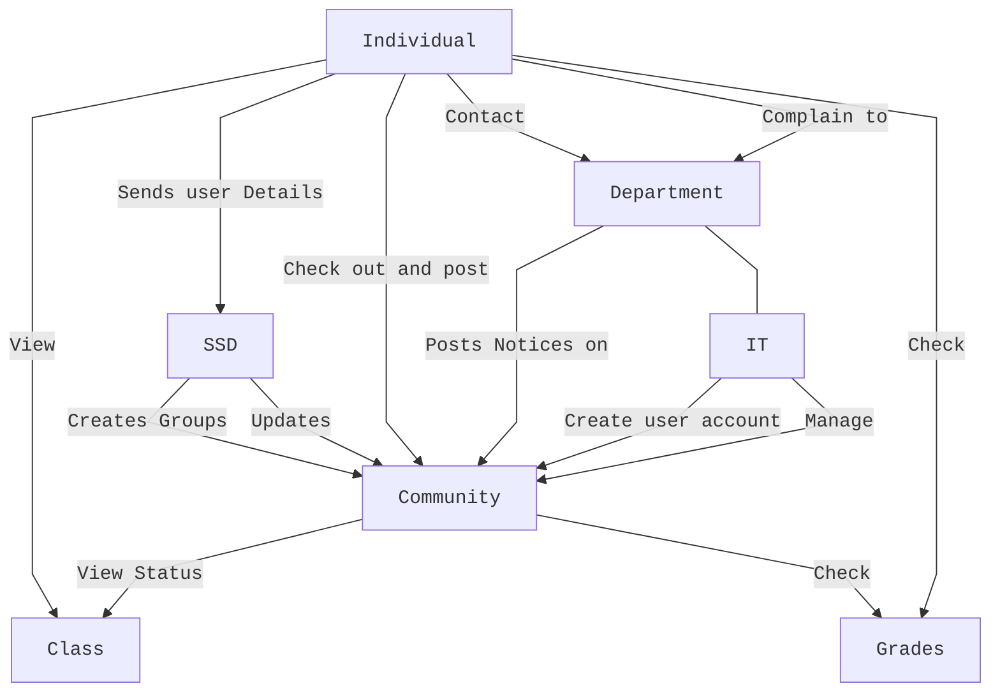
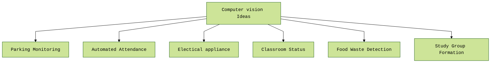

# ISMT Hackathon 2.0 Idea Draft

---

## Research

* How to improve learning efficacy for educational instance using information system

---

## Project 1: ISMT Social App (Community based)

### Purpose

* Fostering and Encouraging Community to grow as a community together

### Feature

* Posting feature for encouraging everyone
* Greatly Community

---

### Project 2: Computer vision (GO Green) IOT Based

Checking if the Classroom is empty and if yes turn off the AC   or any electrical appliances automatically.

#### Parking Monitoring

**Description**: Develop a computer vision system to monitor and manage parking spaces on campus, ensuring efficient use of available parking and assisting students in finding available spots.

**Features**:

* **Real-time Parking Spot Detection**: Identify available and occupied parking spaces.

* **Usage Analytics**: Provide data on parking usage trends and peak times.

* **Violation Alerts**: Detect and notify about parking violations.

#### Automated Attendance

**Description**: Create a system that uses facial recognition to automatically record student attendance in classes, reducing manual efforts and ensuring accurate records.

**Features**:

* **Facial Recognition**: Identify and verify student faces.

* **Attendance Logs**: Maintain a record of attendance for each class session.

* **Real-time Notifications**: Alert students and instructors about attendance status.

* **Integration with School Systems**: Sync attendance data with existing school databases.

#### Electrical Appliance Monitoring

**Description**: Develop a computer vision system to monitor the usage of electrical appliances in classrooms, promoting energy conservation and safety.

**Features**:

* **Usage Tracking**: Monitor the duration and frequency of appliance use.

* **Energy Consumption Analysis**: Provide insights into energy usage patterns.

* **Safety Alerts**: Notify users of potential safety issues, such as overheating or overuse.

#### Classroom Status

**Description**: Create a system that uses computer vision to monitor the status of classrooms, including occupancy, cleanliness, and equipment usage, to optimize classroom management.

**Features**:

* **Occupancy Detection**: Identify whether a classroom is occupied or empty.
* **Cleanliness Monitoring**: Detect cleanliness levels and notify maintenance if needed.

* **Equipment Usage Tracking**: Monitor the usage of classroom equipment like projectors and whiteboards.
* **Status Dashboard**: Provide a real-time overview of classroom conditions.

#### Food Waste Detection

**Description**: Develop a system that uses computer vision to monitor and analyze food waste in canteen, aiming to reduce waste and improve sustainability.

**Features**:

* **Waste Volume Detection**: Measure the amount of food waste generated.

* **Waste Type Classification**: Identify and categorize different types of food waste.

* **Analytics and Reports**: Provide insights and trends on food waste.

* **Sustainability Recommendations**: Offer suggestions to reduce food waste.

#### Study Group Formation

**Description**: Create an app that uses computer vision to facilitate the formation of study groups based on students' interests and study habits.

**Features**:

* **Interest Matching**: Identify and match students with similar academic interests.

* **Facial Recognition**: Verify student identities for group formation.

* **Group Suggestions**: Recommend study groups based on courses and schedules.

* **Collaboration Tools**: Provide tools for scheduling study sessions and sharing resources.

---

## Project 3: Improving quality  of education  using Machine learning  for personalized learning

Based on owns strengths, intrests and prefences learning styles and abilities. The app optimizes the learning experiences to their real potentials.
